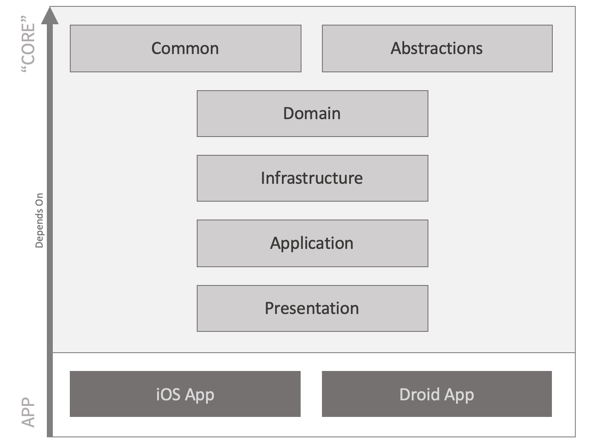

[... CONTENTS](index.md)

---

# FlexiMvvm structure

### Core vs Platform

Let's recap that we have different project types in our Visual Studio solution.
Typically we select appropriate dependencies to add to our solution projects:
- In *Some.Product.Core* project which we traditionally name where code is shared between the mobile platforms, we define common abstractions, add View Models with Application Services like Navigation, Validation, Exception Handling, Connectivity, and so on.
- In *Some.Product.iOS* and *Some.Product.Droid* platform projects, all the mobile specific code is settled (View Controllers, Cell Views, Activities, Fragments, mobile native services, whatever else). And these projects have references to the *Some.Product.Core*.

But going further with a more sophisticated scenario, application architecture may introduce several explicit layers to deal with the complexity, like this:

As FlexiMvvm is modular in nature and has several Nuget packages which cover specific functionality and do depend on "Core" or platform projects, we'll review where FlexiMvvm works best and which NuGet packages are suitable.

### NuGet Packages

| Package                      | Solution Projects to add | Description |
| ---                          | --- | --- |
| **FlexiMvvm.Lifecycle**      | Core (Presentation layer) | One of the most important pieces which enables MVVM adoption and proper navigation approach on iOS and Android, leveraging native lifecycle specifics. Needed on common and platform code. |
| **FlexiMvvm.FullStack**      | iOS App,  Android App | This package is suited for platform-dependent projects bringing everything needed there |
| FlexiMvvm.Bindings           | - | Automatically added as a dependency by FlexiMvvm.FullStack, adding Data Bindings support in terms of MVVM pattern adoption |
| FlexiMvvm.Essentials         | - | Automatically added as a dependency by FlexiMvvm.Lifecycle or FlexiMvvm.FullStack, contains important stuff which provides typical but time consuming implementations |
| FlexiMvvm.Common             | - | Automatically added as a dependency by FlexiMvvm.Lifecycle or FlexiMvvm.FullStack, contains shared building blocks |
| FlexiMvvm.Collections        | TBD | TBD |
| FlexiMvvm.Validation         | TBD | TBD |
| FlexiMvvm.Generation         | TBD | TBD |

---

[Next: First Screen ...](001-introduction-02-first-screen.md)