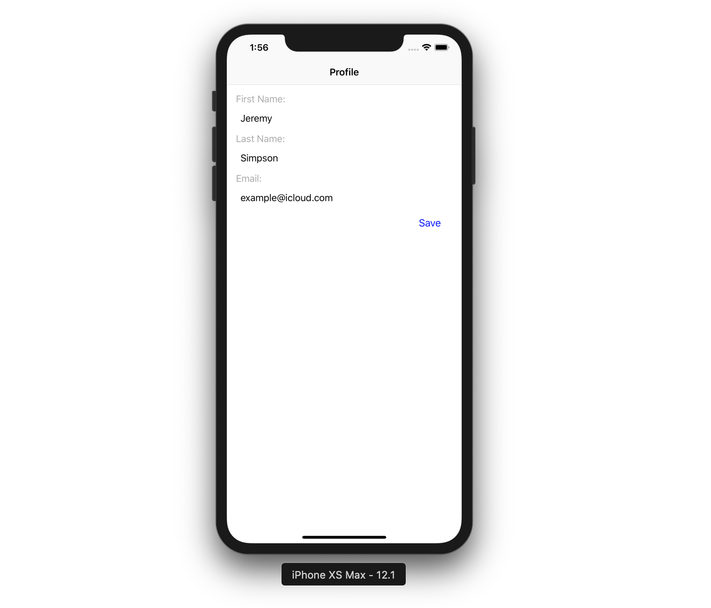
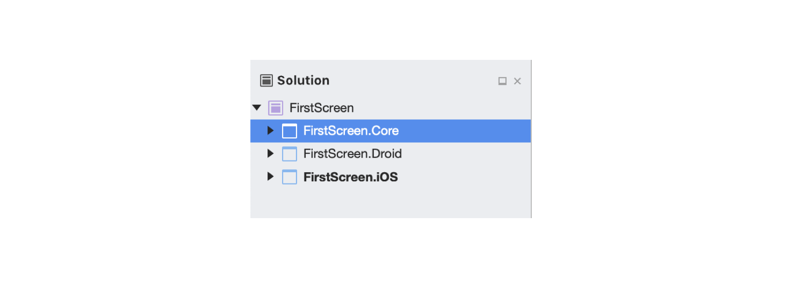
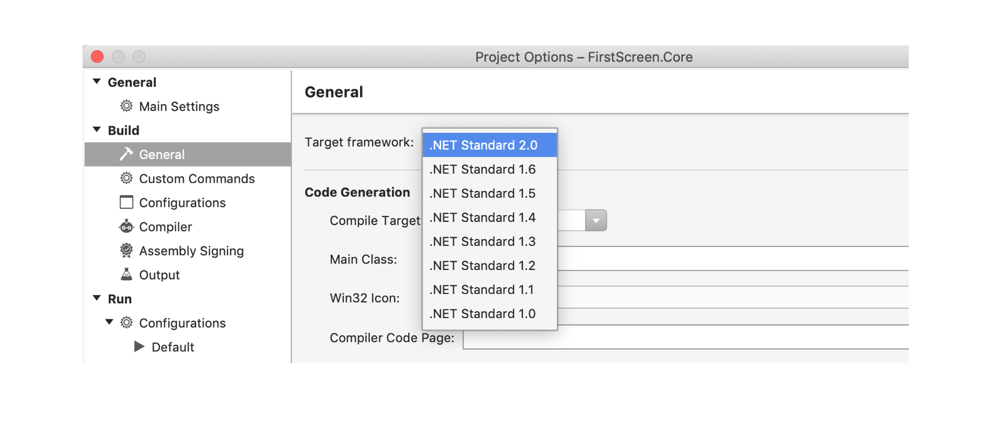
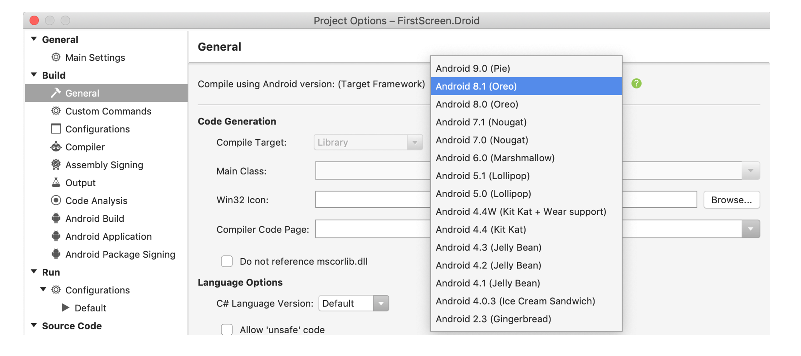
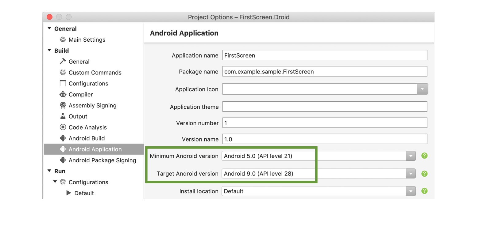
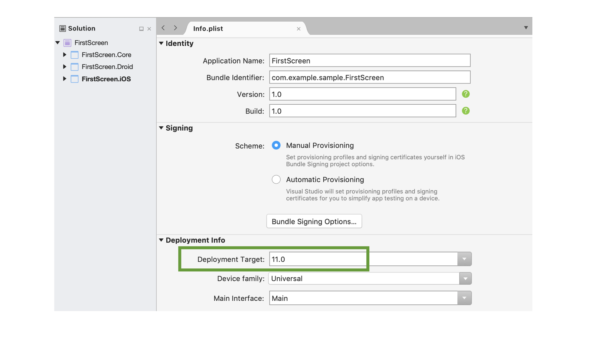

[... Back to CONTENTS](index.md)

---

# Complete sample

Whole sample code is [available in the repository](https://github.com/epam-xamarin-lab/FlexiMvvm/tree/master/samples/001-Intro-FirstScreen/).

# First screen

As a first tutorial, let's build a minimalistic single screen app like this:



Our sample app is going to show just a single screen on start, with a basic Profile form where user can provide the information via text entry fields and "save" it:
- First Name
- Last Name
- Email

### New Visual Studio solution

To get started, we prepare a Visual Studio solution for the app.
For simplicity, let's add just three projects within:



> It's recommended to use **"Droid"** suffix for your Android project, instead of "Android" to make life a bit easier for IDE to distinguish our versus Xamarin SDK namespaces

#### Sample.Core

It has to be compliant to ``.net standard 2.0`` multiplatform spec:



#### Sample.Droid

Let's start with the standard Visual Studio Xamarin Android Single View project template.
1. Add a project reference to Sample.Core.
2. Appropriate target Android SDK is needed. Consider any starting **from Android 8.0 (Oreo)**:

3. Android versions range is needed to be set we're going to support. For our case, we have API Level 21+ support, though API **Level 19+ (Android 4.4, KitKat) may be supported**:


#### Sample.iOS

1. The reference to the Sample.Core project has to be added.
2. **Info.plist** file needs an appropriate Deployment Target. For instance, iOS 11+:


### NuGet Packages

| Project | Package |
| --- | --- |
| *Sample.Core* | **FlexiMvvm.Lifecycle**
| *Sample.Droid* | **FlexiMvvm.FullStack**
| *Sample.iOS* | **FlexiMvvm.FullStack**

> **Preview version**. On the time of documentation, FlexiMvvm was in the Preview mode, with **"PreRelease"** suffixes. Also showing Preview packages option was required to be enabled for NuGet Manager.

### Build configuration

TBD

### View Model

Having all needed external dependencies added, we may try to build the solution and proceed to implementing some core stuff.
Let's create a View Model class for our Profile form, Sample.Core / Presentation / ViewModels:

```cs
using FlexiMvvm.Commands;
using FlexiMvvm.ViewModels;

namespace Sample.Core.Presentation.ViewModels
{
    public class UserProfileViewModel : LifecycleViewModel
    {
        private string _firstName = string.Empty;
        private string _lastName = string.Empty;
        private string _email = string.Empty;

        public string FirstName
        {
            get => _firstName;
            set => SetValue(ref _firstName, value);
        }

        public string LastName
        {
            get => _lastName;
            set => SetValue(ref _lastName, value);
        }

        public string Email
        {
            get => _email;
            set => SetValue(ref _email, value);
        }

        public Command SaveCommand => new RelayCommand(Save);

        private void Save()
        {
            System.Diagnostics.Debug.WriteLine($"Saving: {FirstName} {LastName}, {Email}...");
        }
    }
}

```

``FirstName``, ``LastName`` and ``Email`` string Data Properties are defined to keep values entered by the user and observe their changes to update on the screen. If you review the FlexiMvvm's base classes, you see that the standard ``INotifyPropertyChanged`` interface is implemented for us. All we need is just call the ``SetValue()`` method in our Data Propery setters to engage this mechanism, and the ``PropertyChanged`` event will be invoked automatically bringing Data Bindings to life.

We see here ``LifecycleViewModel`` used as the base class.
This is the FlexiMvvm's cross-platform entry to the proper lifecycle and UI changes support. **Use the ``LifecycleViewModel`` class for your UIViewControllers on iOS and Activities/Fragments on Android.** This base class will allow to conveniently integrate into platforms' screen initialization, closing, state management, etc. ``LifecycleViewModel`` must be used as a root of the per-screen hierarchy of View Models.

> From 0.10.7, FlexiMvvm explicitly separates two kinds of View Models: those for screen events (provided as ``LifecycleViewModel`` used above) and others for supporting subviews, cells, controls whose state and lifecycle tracking is not needed (it's ``ViewModel`` hierarchy). 

Also ``SaveCommand`` is added above and used to call the ``Save()`` method when the user taps such button on the screen.
Such ``Command`` driven handlers is a widely used approach across .NET apps development introducing some extra advantages along with the Data Binding. Use of Commands is considered as a **recommended** way of user events handling.
To simplify the code, FlexiMvvm provides useful ``RelayCommand`` to setup user action handlers. 

As a summary, we've incorporated the most important pillars of MVVM in this first tutorial: Observable Data Properties for Data Binding, UI Lifecycle support, and Commanding.

### Views

#### Android

Starting with Android, let's scaffold a minimal app with a single Activity.

In this tutorial, we may start with the standard "Single View" Visual Studio project template for Xamarin Android app and update its Sample.Droid / Resources / layout / [activity_main.axml](https://github.com/epam-xamarin-lab/FlexiMvvm/tree/master/samples/001-Intro-FirstScreen/Droid/Resources/layout/activity_main.axml) with basic UI layout for the new Activity. Just ``TextViews``, ``EditText`` and ``Button`` controls within ``LinearLayout``.

Finally, we approached the Activity which needs FlexiMvvm specific customizations. Sample.Droid / ``MainActivity``. Here is its full definition:

```cs
using Android.App;
using Android.OS;
using Android.Views;
using Android.Widget;
using FlexiMvvm;
using FlexiMvvm.Bindings;
using FlexiMvvm.Ioc;
using FlexiMvvm.ViewModels;
using FlexiMvvm.Views;
using Sample.Core.Presentation.ViewModels;

namespace Sample.Droid
{
    [Activity(Label = "@string/app_name", Theme = "@style/AppTheme.NoActionBar", MainLauncher = true, NoHistory = true)]
    public class MainActivity : BindableAppCompatActivity<UserProfileViewModel>
    {
        private EditText _firstName;
        private EditText _lastName;
        private EditText _email;
        private Button _save;

        protected override void OnCreate(Bundle savedInstanceState)
        {
            InitApp();

            base.OnCreate(savedInstanceState);

            SetContentView(Resource.Layout.activity_main);
            SetSupportActionBar(FindViewById<Android.Support.V7.Widget.Toolbar>(Resource.Id.toolbar));

            _firstName = FindViewById<EditText>(Resource.Id.firstName);
            _lastName = FindViewById<EditText>(Resource.Id.lastName);
            _email = FindViewById<EditText>(Resource.Id.email);
            _save = FindViewById<Button>(Resource.Id.save);
        }

        public override bool OnCreateOptionsMenu(IMenu menu)
        {
            MenuInflater.Inflate(Resource.Menu.menu_main, menu);
            return true;
        }

        public override bool OnOptionsItemSelected(IMenuItem item)
        {
            int id = item.ItemId;
            if (id == Resource.Id.action_settings)
            {
                return true;
            }

            return base.OnOptionsItemSelected(item);
        }

        public override void Bind(BindingSet<UserProfileViewModel> bindingSet)
        {
            base.Bind(bindingSet);

            bindingSet.Bind(_firstName)
                .For(v => v.TextAndTextChangedBinding())
                .To(vm => vm.FirstName);

            bindingSet.Bind(_lastName)
                .For(v => v.TextAndTextChangedBinding())
                .To(vm => vm.LastName);

            bindingSet.Bind(_email)
                .For(v => v.TextAndTextChangedBinding())
                .To(vm => vm.Email);

            bindingSet.Bind(_save)
              .For(v => v.ClickBinding())
              .To(vm => vm.SaveCommand);
        }

        private void InitApp()
        {
            var container = new SimpleIoc();
            container.Register(() => new UserProfileViewModel());

            LifecycleViewModelProvider.SetFactory(
                new DefaultLifecycleViewModelFactory(container));
        }
    }
}

```

We see this ``MainActivity`` has the FlexiMvvm's ``BindableAppCompatActivity`` base class which has got our ``UserProfileViewModel`` as the type parameter. Doing this, we indirectly link our View with its View Model (so MVVM is engaged here).
And by overriding the ``Bind()`` method, we are able to define all the required Data Bindings between the User Interface and the observable Data.

FlexiMvvm provides a wide range of default Data Bindings to iOS and Android standard controls. Custom Data Binding is possible as well.

And another major part here is the ``InitApp()`` method which is placed in Activity for simplicity. ``SimpleIoc`` is available as an out-of-the-box Inversion of Control (IoC) container, to hold dependencies and provide their instances on demand. For now we have just a single registration entry, our ``UserProfileViewModel``.

> On mobile, performance and application start time specifically are pretty critial qualities. ``SimpleIoc`` is good on that. **No Reflection** is used by ``SimpleIoc`` to automate dependencies resolution but all the instantiation logic is provided by us explicitly via the ``Register()`` method. It's recommended though not mandatory - any container may be involved instead.

Then we use ``LifecycleViewModelProvider`` which is central for View Model instance provisioning and leverage the existing factory passed in, ``DefaultLifecycleViewModelFactory``. The latter gets our container (and uses it internally) with the registered View Model.

#### iOS

Same way, let's create a minimalistic iOS app with the single screen, starting with Sample.iOS / AppDelegate.cs:

```cs
using FlexiMvvm.Ioc;
using FlexiMvvm.ViewModels;
using Foundation;
using UIKit;
using Sample.Core.Presentation.ViewModels;
using Sample.iOS.Views;

namespace Sample.iOS
{
    [Register("AppDelegate")]
    public class AppDelegate : UIApplicationDelegate
    {
        public override UIWindow Window { get; set; }

        public override bool FinishedLaunching(UIApplication application, NSDictionary launchOptions)
        {
            InitApp();

            Window = new UIWindow(UIScreen.MainScreen.Bounds) { RootViewController = new UserProfileViewController() };
            Window.MakeKeyAndVisible();

            return true;
        }

        private void InitApp()
        {
            var container = new SimpleIoc();
            container.Register(() => new UserProfileViewModel());

            LifecycleViewModelProvider.SetFactory(
                new DefaultLifecycleViewModelFactory(container));
        }
    }
}

```

It has the same ``InitApp()`` logic as the Android version. As a root View Controller, our new ``UserProfileViewController`` is used. Let's add this, Sample.iOS / Views / UserProfileViewController.cs:

```cs
using FlexiMvvm.Bindings;
using FlexiMvvm.Views;
using Sample.Core.Presentation.ViewModels;

namespace Sample.iOS.Views
{
    public class UserProfileViewController : BindableViewController<UserProfileViewModel>
    {
        public new UserProfileView View
        {
            get => (UserProfileView)base.View;
            set => base.View = value;
        }

        public override void LoadView()
        {
            View = new UserProfileView();
        }

        public override void Bind(BindingSet<UserProfileViewModel> bindingSet)
        {
            base.Bind(bindingSet);

            bindingSet.BindDefault(View.FirstName)
                .To(vm => vm.FirstName);

            bindingSet.BindDefault(View.LastName)
                .To(vm => vm.LastName);

            bindingSet.BindDefault(View.Email)
                .To(vm => vm.Email);

            bindingSet.Bind(View.SaveButton)
                .For(v => v.TouchUpInsideBinding())
                .To(vm => vm.SaveCommand);
        }
    }
}

```

Generic ``BindableViewController`` is provided by FlexiMvvm, the similar way as for the Android Activity. It allows to specify needed Data Bindings to the source View Model.

Then ``UserProfileViewController`` incapsulates the View it's going to work with and use it in Data Bindings definitions, within the ``Bind()`` method.

The last but not least is the View, Sample.iOS / Views / UserProfileView.cs:

```cs
using Cirrious.FluentLayouts.Touch;
using FlexiMvvm.Views;
using Sample.iOS.Themes;
using UIKit;

namespace Sample.iOS.Views
{
    public class UserProfileView : LayoutView
    {
        private UILabel FirstNameLabel { get; set; }

        private UILabel LastNameLabel { get; set; }

        private UILabel EmailLabel { get; set; }

        public UITextField FirstName { get; set; }

        public UITextField LastName { get; set; }

        public UITextField Email { get; set; }

        public UIButton SaveButton { get; private set; }

        protected override void SetupSubviews()
        {
            base.SetupSubviews();

            BackgroundColor = Theme.Colors.BackgroundColor;

            FirstNameLabel = new UILabel().AsRegularBodyStyle("First Name:");
            LastNameLabel = new UILabel().AsRegularBodyStyle("Last Name:");
            EmailLabel = new UILabel().AsRegularBodyStyle("Email:");

            FirstName = new UITextField().AsTextFieldStyle("...");
            LastName = new UITextField().AsTextFieldStyle("...");
            Email = new UITextField().AsTextFieldStyle("example@icloud.com");

            SaveButton = new UIButton().AsRegularButtonStyle("Save");
        }

        protected override void SetupLayout()
        {
            base.SetupLayout();

            AddSubview(FirstNameLabel);
            AddSubview(LastNameLabel);
            AddSubview(EmailLabel);
            AddSubview(FirstName);
            AddSubview(LastName);
            AddSubview(Email);
            AddSubview(SaveButton);
        }

        protected override void SetupLayoutConstraints()
        {
            base.SetupLayoutConstraints();
            this.SubviewsDoNotTranslateAutoresizingMaskIntoConstraints();

            this.AddConstraints(
                FirstNameLabel.AtLeftOf(this, Theme.Dimensions.Inset2x),
                FirstNameLabel.AtTopOfSafeArea(this, Theme.Dimensions.Inset2x),
                FirstNameLabel.AtRightOf(this, Theme.Dimensions.Inset2x),
                FirstNameLabel.Height().EqualTo(Theme.Dimensions.LabelBodyHeight));
            this.AddConstraints(
                FirstName.AtLeftOf(this, Theme.Dimensions.Inset3x),
                FirstName.Below(FirstNameLabel, Theme.Dimensions.Inset1x),
                FirstName.AtRightOf(this, Theme.Dimensions.Inset2x),
                FirstName.Height().EqualTo(Theme.Dimensions.TextFieldRegularHeight));

            this.AddConstraints(
                LastNameLabel.AtLeftOf(this, Theme.Dimensions.Inset2x),
                LastNameLabel.Below(FirstName, Theme.Dimensions.Inset1x),
                LastNameLabel.AtRightOf(this, Theme.Dimensions.Inset2x),
                LastNameLabel.Height().EqualTo(Theme.Dimensions.LabelBodyHeight));
            this.AddConstraints(
                LastName.AtLeftOf(this, Theme.Dimensions.Inset3x),
                LastName.Below(LastNameLabel, Theme.Dimensions.Inset1x),
                LastName.AtRightOf(this, Theme.Dimensions.Inset2x),
                LastName.Height().EqualTo(Theme.Dimensions.TextFieldRegularHeight));

            this.AddConstraints(
                EmailLabel.AtLeftOf(this, Theme.Dimensions.Inset2x),
                EmailLabel.Below(LastName, Theme.Dimensions.Inset1x),
                EmailLabel.AtRightOf(this, Theme.Dimensions.Inset2x),
                EmailLabel.Height().EqualTo(Theme.Dimensions.LabelBodyHeight));
            this.AddConstraints(
                Email.AtLeftOf(this, Theme.Dimensions.Inset3x),
                Email.Below(EmailLabel, Theme.Dimensions.Inset1x),
                Email.AtRightOf(this, Theme.Dimensions.Inset2x),
                Email.Height().EqualTo(Theme.Dimensions.TextFieldRegularHeight));

            this.AddConstraints(
                SaveButton.Width().EqualTo(80),
                SaveButton.Below(Email, Theme.Dimensions.Inset2x),
                SaveButton.AtRightOf(this, Theme.Dimensions.Inset2x),
                SaveButton.Height().EqualTo(Theme.Dimensions.ButtonRegularHeight));
        }
    }
}

```

As a first observation, we're facing the **code-driven UI approach** for iOS. It has several reasons based on the Xamarin development experience in a team:
- Ui in code approach is considered as radically reliable, if solid convention is used by developers. One of possible solutions is [Cirrious.FluentLayout](https://github.com/FluentLayout/Cirrious.FluentLayout) which has become even a one of FlexiMvvm's external dependencies.
- No need to depend on iOS Interface Builder performance or stability, either via Visual Studio or Xcode.
- No team collaboration issues when a single View is changed simultaneously. It may be resolved in a usual way while git branch merging. With iOS XIBs and Storyboards such trick does not look feasible.
- Either Frames or Auto Layout constraints are fully available in code.

By overriding the ``SetupSubviews()`` method, we instanciate all child Views and Controls needed. ``AsRegularBodyStyle()``, ``AsTextFieldStyle()``, ``AsRegularButtonStyle()`` are just our extension methods which return instances with the appearance and styles applied. Examples are shown in the ``Theme`` class below.

In ``SetupLayout()`` we're building the View's hierarchy; in our case, it's just a flat list of child controls.

Finally, in ``SetupLayoutConstraints()`` we're engaging FluentLayout to build the layout, bringing some ``Theme`` values, from the new static class, Sample.iOS / Themes / Theme.cs:

```cs
using System;
using UIKit;

namespace Sample.iOS.Themes
{
    internal static class Theme
    {
        public static UILabel AsRegularBodyStyle(this UILabel label, string text = null)
        {
            label.TextColor = Colors.LabelBodyColor;
            label.Lines = 1;
            label.LineBreakMode = UILineBreakMode.Clip;
            label.TextAlignment = UITextAlignment.Natural;
            label.Text = text;

            return label;
        }

        public static UITextField AsTextFieldStyle(this UITextField textField, string placeHolder = null)
        {
            textField.Placeholder = placeHolder;
            textField.TintColor = Colors.TintColor;

            return textField;
        }

        public static UIButton AsRegularButtonStyle(this UIButton button, string title = null)
        {
            button.SetTitle(title, UIControlState.Normal);
            button.SetTitleColor(Colors.ButtonColor, UIControlState.Normal);
            button.Layer.MasksToBounds = true;

            return button;
        }

        public static class Colors
        {
            public static readonly UIColor BackgroundColor = UIColor.White;
            public static readonly UIColor LabelBodyColor = UIColor.LightGray;
            public static readonly UIColor TintColor = UIColor.DarkGray;
            public static readonly UIColor ButtonColor = UIColor.Blue;
        }

        public static class Dimensions
        {
            public static readonly nfloat LabelBodyHeight = 18;
            public static readonly nfloat TextFieldRegularHeight = 36;
            public static readonly nfloat ButtonRegularHeight = 20;

            public static readonly nfloat Inset1x = 8;
            public static readonly nfloat Inset2x = 16;
            public static readonly nfloat Inset3x = 24;
            public static readonly nfloat Inset6x = 48;
        }
    }
}

```

It's radically simple, just for the demonstration.

Actually, ``Theme`` is out of the FlexiMvvm scope - any approach may be used for iOS Views styling. Though, we treat this technic as **recommended**. Having all appearance definitions centralized in a single place, it's easier to maintain all colors, styles, dimentions, fonts, etc. Especially when validating against the Android part. Also it helps to keep the Views layout code concise and readable.

### Data Bindings in action

For now we may build and run the app, though let's add a tiny update to the View Model. To demonstrate that Data Bindings work two-way, from source View Model and back from target View, let's initialize Data Properties with some values and let Data Bindings to propagate changes onto UI.

For View Model initialization, either ``InitializeAsync()`` or ``Initialize()`` may be used.

> Starting from 0.10.7, FlexiMvvm shows whether the screen was re-created by the platform. Typically on Android, this is caused by the device rotation - current Activity is being destroyed and instantiated by OS again. On iOS, ``recreated`` parameter for a View Model is going to be always **false** as there's no such specifics there.

> ``InitializeAsync`` calls its ``Initialize()`` synchronous counterpart method. So don't forget to call ``await base.InitializeAsync(recreated)`` when overriding it.

So going back to ``UserProfileViewModel``, let's add the method:

```cs

        public override void Initialize(bool recreated)
        {
            base.Initialize(recreated);

            FirstName = "Jeremy";
            LastName = "Simpson";
        }

```

As a result, 
- On start "Jeremy" and "Simpson" values will be propagated by Data Bindings from View Model to UI onto the First Name and Last Name text input fields;
- When editing and saving, our View Model's ``Save()`` method will show in the Output that changed values are pushed back from UI into source Data Properties

---

[Next: Basic Navigation...](001-introduction-03-navigation.md)