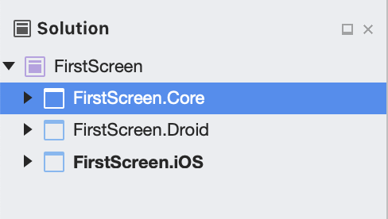
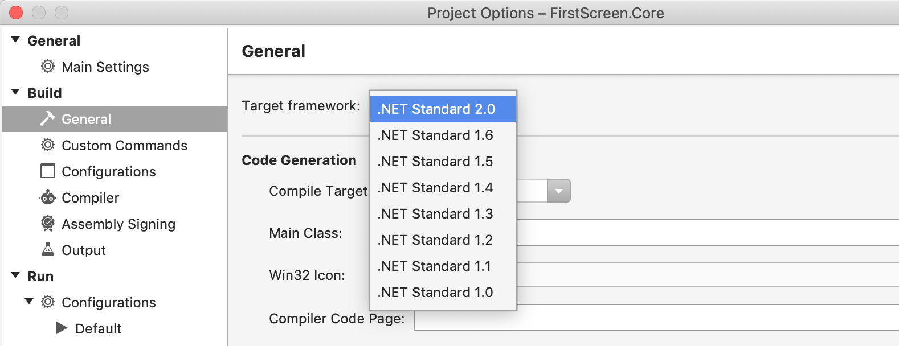
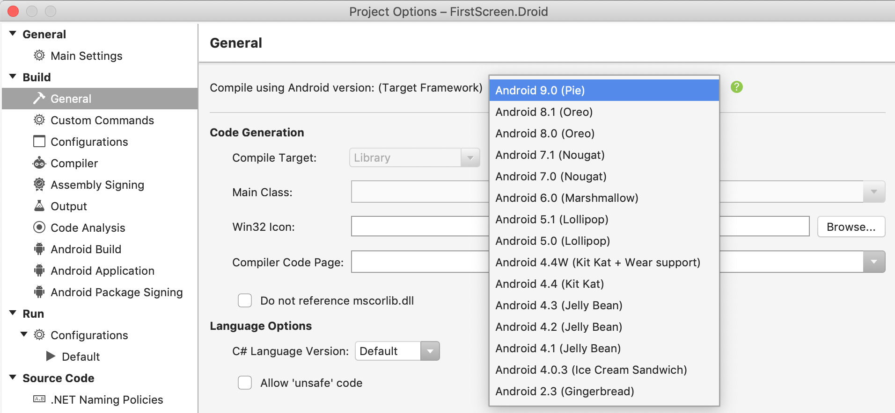
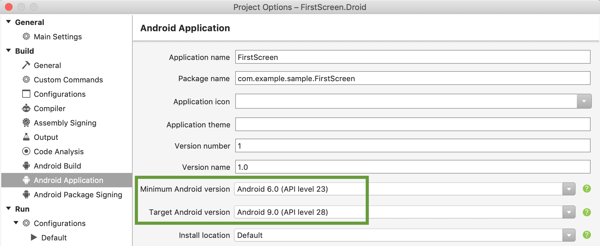
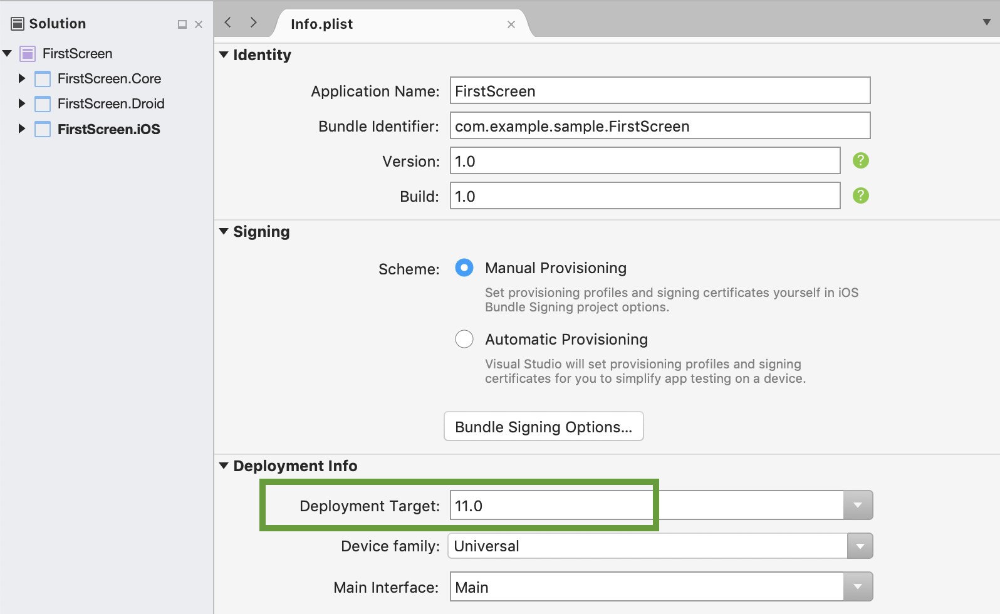

[... Back to CONTENTS](index.md)

---

# First screen

### New Visual Studio solution

To get started, prepare your Visual Studio solution for the app.
For simplicity, let's assume you have three projects within:



- **FirstScreen.Core** for the shared code
	- It's compliant to ``.net standard 2.0`` multiplatform spec:
	
- **FirstScreen.Droid** for the Android code
	- It has a reference to the FirstScreen.Core project
	- Appropriate target Android SDK is selected. Consider any starting **from Android 8.0 (Oreo)**:
	
	- Android versions range is set we're going to support. For our case, we have API Level 21+ support, though API Level 19+ (Android 4.4 (KitKat)) may be supported
	
- **FirstScreen.iOS** for the iOS platform code
	- It has a reference to the FirstScreen.Core project
	- Info.plist file has selected Deployment Target. For instance, iOS 11+:
	

> It's recommended to use **"Droid"** suffix for your Android project, instead of "Android" to make life a bit easier for IDE to distinguish our versus Xamarin SDK namespaces

Our sample app is going to show just a single screen on start, with a basic Profile form where user can provide the information via text entry fields and save it:
- First Name
- Last Name
- Email

### Adding NuGet Packages

| Project | Package |
| --- | --- |
| *FirstScreen.Core* | **FlexiMvvm.Lifecycle**
| *FirstScreen.Droid* | **FlexiMvvm.FullStack**
| *FirstScreen.iOS* | **FlexiMvvm.FullStack**

> On the time of documentation, FlexiMvvm was in the Preview mode, with **"PreRelease"** suffixes. Also showing Preview packages option was required to be enabled for NuGet Manager.

### View Models

Having all needed external dependencies added, we may try to build the solution and proceed to implementing some core stuff.
Let's create a View Model class for our Profile form, FirstScreen.Core / Presentation / ViewModels:

```cs
using System.Windows.Input;
using FlexiMvvm.ViewModels;

namespace FirstScreen.Core.Presentation.ViewModels
{
    public class UserProfileViewModel : ViewModel
    {
        private string _firstName;
        private string _lastName;
        private string _email;
        
        public string FirstName
        {
            get => _firstName;
            set => SetValue(ref _firstName, value);
        }

        public string LastName
        {
            get => _lastName;
            set => SetValue(ref _lastName, value);
        }

        public string Email
        {
            get => _email;
            set => SetValue(ref _email, value);
        }

        public ICommand SaveCommand => CommandProvider.Get(Save);

        private void Save()
        {
            System.Diagnostics.Debug.WriteLine(
                $"Saved: {FirstName} {LastName}, {Email}.");
        }
    }
}
```

So, ``FirstName``, ``LastName``, ``Email`` string Data Properties are defined to observe values entered by user.

We see here ``ViewModel`` used as the base class.
This is the FlexiMvvm's cross-platform entry to the proper lifecycle and UI changes observation mechanisms. ``ViewModel`` must be used as a root of the hierarchy of our View Models.

To recap, when adopting MVVM we create View Models which implement standard ``INotifyPropertyChanged`` interface. In our sample above,
base ``ViewModel`` type provided by FlexiMvvm is used, therefore child View Model inherits the appropriate ``INotifyPropertyChanged`` implementation. Just to engage it, we have added ``SetValue()`` methods in the Data Properties' setters - the ``PropertyChanged`` event will be invoked automatically when needed, bringing Data Bindings to life.

Also ``SaveCommand`` is added and used to call the ``Save()`` method when the user taps such button on the screen.
As we will see later, such ``ICommand`` driven handlers is a widely used approach across .net apps development introducing some extra advantages along with Data Bindings. Use of Commands is considered as a **recommended** way of user events handling.
To simplify the code, FlexiMvvm provides useful ``CommandProvider`` to setup Commands in different ways. Later we will review it in details.

### Views

#### Android

Starting with Android, let's scaffold a minimal app with a single Activity. The following points are quite regular for any Xamarin.Android app and just summarised:

1. FirstScreen.Droid / Resources / layout / Main.axml: basic UI layout for the new Activity. Just ``TextViews``, ``EditText`` and ``Button`` controls within ``LinearLayout``s.
2. FirstScreen.Droid / Resources / values / styles.xml: Theme setup
3. FirstScreen.Droid / Resources / values / colors.xml: Colors definitions
4. FirstScreen.Droid / Resources / values / Strings.xml: string resources

Finally, we approached the Activity which needs FlexiMvvm specific customizations. FirstScreen.Droid / Views / ``UserProfileActivity``. Here is its full definition:

```cs
using Android.App;
using Android.OS;
using Android.Widget;
using FirstScreen.Core.Presentation.ViewModels;
using FlexiMvvm.Bindings;
using FlexiMvvm.Ioc;
using FlexiMvvm.ViewModels;
using FlexiMvvm.Views;

namespace FirstScreen.Droid.Views
{
    [Activity(MainLauncher = true, NoHistory = true, Theme = "@style/AppTheme")]
    public class UserProfileActivity : BindableAppCompatActivity<UserProfileViewModel>
    {
        private EditText _firstName;
        private EditText _lastName;
        private EditText _email;
        private Button _save;

        protected override void OnCreate(Bundle savedInstanceState)
        {
            InitApp();

            SetContentView(Resource.Layout.Main);

            _firstName = FindViewById<EditText>(Resource.Id.firstName);
            _lastName = FindViewById<EditText>(Resource.Id.lastName);
            _email = FindViewById<EditText>(Resource.Id.email);
            _save = FindViewById<Button>(Resource.Id.save);

            base.OnCreate(savedInstanceState);
        }

        public override void Bind(BindingSet<UserProfileViewModel> bindingSet)
        {
            base.Bind(bindingSet);

            bindingSet.Bind(_firstName)
                .For(v => v.TextAndTextChangedBinding())
                .To(vm => vm.FirstName);

            bindingSet.Bind(_lastName)
                .For(v => v.TextAndTextChangedBinding())
                .To(vm => vm.LastName);

            bindingSet.Bind(_email)
                .For(v => v.TextAndTextChangedBinding())
                .To(vm => vm.Email);

            bindingSet.Bind(_save)
              .For(v => v.ClickBinding())
              .To(vm => vm.SaveCommand);
        }

        private void InitApp()
        {
            var container = new SimpleIoc();
            container.Register(() => new UserProfileViewModel());

            ViewModelProvider.SetFactory(new DependencyProviderViewModelFactory(container));
        }
    }
}
```

We see this ``UserProfileActivity`` has uncommon base class, FlexiMvvm's ``BindableAppCompatActivity`` which has got our View Model as the type parameter. Doing this, we indirectly link our View with its View Model. And by overriding ``Bind()`` method, we are able to define all required Data Bindings between the User Interface and the observable Data.

> Later a better way will be demostrated with code-generated ``ViewHolder``s, without the need to inflate each user control and preserve in a private field.

FlexiMvvm provides a wide range of default Data Bindings to iOS and Android standard controls. Custom Data Binding is possible as well.

And another major part here is the ``InitApp()`` method which is placed in Activity for simplicity. ``SimpleIoc`` is available as an out-of-the-box Inversion of Control (IoC) container, to hold dependencies and provide their instances on demand. For now we have just a single registration entry, our ``UserProfileViewModel``.

> On mobile, performance and application start time specifically are pretty critial qualities. ``SimpleIoc`` is good on that. **No Reflection** is used by ``SimpleIoc`` to automate dependencies resolution but all the instantiation logic is provided by us explicitly via the ``Register()`` method. It's recommended though not mandatory - any container may be involved instead.

Then we use ``ViewModelProvider`` which is central for View Model instance provisioning and leverage the existing factory passed in, ``DependencyProviderViewModelFactory``. The latter gets our container (and uses it internally) with the registered View Model.

#### iOS

Same way, let's create a minimalistic iOS app with the single screen, starting with FirstScreen.iOS / AppDelegate.cs:

```cs
using FirstScreen.Core.Presentation.ViewModels;
using FirstScreen.iOS.Views;
using FlexiMvvm.Ioc;
using FlexiMvvm.ViewModels;
using Foundation;
using UIKit;

namespace FirstScreen.iOS
{
    [Register("AppDelegate")]
    public class AppDelegate : UIApplicationDelegate
    {
        public override UIWindow Window { get; set; }

        public override bool FinishedLaunching(UIApplication application, NSDictionary launchOptions)
        {
            InitApp();

            Window = new UIWindow(UIScreen.MainScreen.Bounds) { RootViewController = new UserProfileViewController() };
            Window.MakeKeyAndVisible();

            return true;
        }

        private void InitApp()
        {
            var container = new SimpleIoc();
            container.Register(() => new UserProfileViewModel());

            ViewModelProvider.SetFactory(new DependencyProviderViewModelFactory(container));
        }
    }
}
```

It has the same ``InitApp()`` logic as the Android version. As a root View Controller, our new ``UserProfileViewController`` is used. Let's add this new class, FirstScreen.iOS / Views / UserProfileViewController.cs:

```cs
using System;
using FirstScreen.Core.Presentation.ViewModels;
using FlexiMvvm.Bindings;
using FlexiMvvm.Views;

namespace FirstScreen.iOS.Views
{
    public class UserProfileViewController : BindableViewController<UserProfileViewModel>
    {
        public new UserProfileView View
        {
            get => (UserProfileView)base.View;
            set => base.View = value;
        }

        public override void LoadView()
        {
            View = new UserProfileView();
        }

        public override void Bind(BindingSet<UserProfileViewModel> bindingSet)
        {
            base.Bind(bindingSet);

            bindingSet.BindDefault(View.FirstName)
                .To(vm => vm.FirstName);

            bindingSet.BindDefault(View.LastName)
                .To(vm => vm.LastName);

            bindingSet.BindDefault(View.Email)
                .To(vm => vm.Email);

            bindingSet.Bind(View.SaveButton)
                .For(v => v.TouchUpInsideBinding())
                .To(vm => vm.SaveCommand);
        }
    }
}
```

Generic ``BindableViewController`` is provided by FlexiMvvm, the similar way as for the Android Activity. It allows to specify needed Data Bindings to the source View Model.

Then ``UserProfileViewController`` incapsulates the View it's going to work with and use it in Data Bindings definitions, within the ``Bind()`` method.

The last but not least is the View, FirstScreen.iOS / Views / UserProfileView.cs:

```cs
using System;
using Cirrious.FluentLayouts.Touch;
using FirstScreen.iOS.Themes;
using FlexiMvvm.Views;
using UIKit;

namespace FirstScreen.iOS.Views
{
    public class UserProfileView : LayoutView
    {
        private UILabel FirstNameLabel { get; set; }
        private UILabel LastNameLabel { get; set; }
        private UILabel EmailLabel { get; set; }

        public UITextField FirstName { get; set; }
        public UITextField LastName { get; set; }
        public UITextField Email { get; set; }

        public UIButton SaveButton { get; private set; }

        protected override void SetupSubviews()
        {
            base.SetupSubviews();

            BackgroundColor = Theme.Colors.BackgroundColor;

            FirstNameLabel = new UILabel().AsRegularBodyStyle("First Name:");
            LastNameLabel = new UILabel().AsRegularBodyStyle("Last Name:");
            EmailLabel = new UILabel().AsRegularBodyStyle("Email:");

            FirstName = new UITextField().AsTextFieldStyle("...");
            LastName = new UITextField().AsTextFieldStyle("...");
            Email = new UITextField().AsTextFieldStyle("example@icloud.com");

            SaveButton = new UIButton().AsRegularButtonStyle("Save");
        }

        protected override void SetupLayout()
        {
            base.SetupLayout();

            AddSubview(FirstNameLabel);
            AddSubview(LastNameLabel);
            AddSubview(EmailLabel);
            AddSubview(FirstName);
            AddSubview(LastName);
            AddSubview(Email);
            AddSubview(SaveButton);
        }

        protected override void SetupLayoutConstraints()
        {
            base.SetupLayoutConstraints();
            this.SubviewsDoNotTranslateAutoresizingMaskIntoConstraints();

            this.AddConstraints(
                FirstNameLabel.AtLeftOf(this, Theme.Dimensions.Inset2x),
                FirstNameLabel.AtTopOf(this, Theme.Dimensions.Inset6x),
                FirstNameLabel.AtRightOf(this, Theme.Dimensions.Inset2x),
                FirstNameLabel.Height().EqualTo(Theme.Dimensions.LabelBodyHeight));
            this.AddConstraints(
                FirstName.AtLeftOf(this, Theme.Dimensions.Inset3x),
                FirstName.Below(FirstNameLabel, Theme.Dimensions.Inset1x),
                FirstName.AtRightOf(this, Theme.Dimensions.Inset2x),
                FirstName.Height().EqualTo(Theme.Dimensions.TextFieldRegularHeight));

            this.AddConstraints(
                LastNameLabel.AtLeftOf(this, Theme.Dimensions.Inset2x),
                LastNameLabel.Below(FirstName, Theme.Dimensions.Inset1x),
                LastNameLabel.AtRightOf(this, Theme.Dimensions.Inset2x),
                LastNameLabel.Height().EqualTo(Theme.Dimensions.LabelBodyHeight));
            this.AddConstraints(
                LastName.AtLeftOf(this, Theme.Dimensions.Inset3x),
                LastName.Below(LastNameLabel, Theme.Dimensions.Inset1x),
                LastName.AtRightOf(this, Theme.Dimensions.Inset2x),
                LastName.Height().EqualTo(Theme.Dimensions.TextFieldRegularHeight));

            this.AddConstraints(
                EmailLabel.AtLeftOf(this, Theme.Dimensions.Inset2x),
                EmailLabel.Below(LastName, Theme.Dimensions.Inset1x),
                EmailLabel.AtRightOf(this, Theme.Dimensions.Inset2x),
                EmailLabel.Height().EqualTo(Theme.Dimensions.LabelBodyHeight));
            this.AddConstraints(
                Email.AtLeftOf(this, Theme.Dimensions.Inset3x),
                Email.Below(EmailLabel, Theme.Dimensions.Inset1x),
                Email.AtRightOf(this, Theme.Dimensions.Inset2x),
                Email.Height().EqualTo(Theme.Dimensions.TextFieldRegularHeight));

            this.AddConstraints(
                SaveButton.Width().EqualTo(80),
                SaveButton.Below(Email, Theme.Dimensions.Inset2x),
                SaveButton.AtRightOf(this, Theme.Dimensions.Inset2x),
                SaveButton.Height().EqualTo(Theme.Dimensions.ButtonRegularHeight));
        }
    }
}
```

As a first observation, we're facing the **code-driven UI approach** for iOS. It has several reasons based on the Xamarin development experience in a team:
- Ui in code approach is considered as radically reliable, if solid convention is used by developers. One of possible solutions is [Cirrious.FluentLayout](https://github.com/FluentLayout/Cirrious.FluentLayout) which has become even a one of FlexiMvvm's external dependencies.
- No need to depend on iOS Interface Builder performance or stability, either via Visual Studio or Xcode.
- No team collaboration issues when a single View is changed simultaneously. It may be resolved in a usual way while git branch merging. With iOS XIBs and Storyboards such trick does not look feasible.
- Either Frames or Auto Layout constraints are fully available in code.

By overriding the ``SetupSubviews()`` method, we instanciate all child Views and Controls needed. ``AsRegularBodyStyle()``, ``AsTextFieldStyle()``, ``AsRegularButtonStyle()`` are just our extension methods which return instances with the appearance and styles applied. Examples are shown in the ``Theme`` class below.

In ``SetupLayout()`` we're building the View's hierarchy; in our case, it's just a flat list of child controls.

Finally, in ``SetupLayoutConstraints()`` we're engaging FluentLayout to build the layout, bringing some ``Theme`` values, from the new static class, FirstScreen.iOS / Themes / Theme.cs:

```cs
using System;
using UIKit;

namespace FirstScreen.iOS.Themes
{
    internal static class Theme
    {
        public static class Colors
        {
            public readonly static UIColor BackgroundColor = UIColor.White;
            public readonly static UIColor LabelBodyColor = UIColor.LightGray;
            public readonly static UIColor TintColor = UIColor.DarkGray;
            public readonly static UIColor ButtonColor = UIColor.Blue;
        }

        public static class Dimensions
        {
            public readonly static nfloat LabelBodyHeight = 18;
            public readonly static nfloat TextFieldRegularHeight = 36;
            public readonly static nfloat ButtonRegularHeight = 20;

            public readonly static nfloat Inset1x = 8;
            public readonly static nfloat Inset2x = 16;
            public readonly static nfloat Inset3x = 24;
            public readonly static nfloat Inset6x = 48;
        }

        public static UILabel AsRegularBodyStyle(this UILabel label, string text = null)
        {
            label.TextColor = Colors.LabelBodyColor;
            label.Lines = 1;
            label.LineBreakMode = UILineBreakMode.Clip;
            label.TextAlignment = UITextAlignment.Natural;
            label.Text = text;

            return label;
        }

        public static UITextField AsTextFieldStyle(this UITextField textField, string placeHolder = null)
        {
            textField.Placeholder = placeHolder;
            textField.TintColor = Colors.TintColor;

            return textField;
        }

        public static UIButton AsRegularButtonStyle(this UIButton button, string title = null)
        {
            button.SetTitle(title, UIControlState.Normal);
            button.SetTitleColor(Colors.ButtonColor, UIControlState.Normal);
            button.Layer.MasksToBounds = true;

            return button;
        }
    }
}
```

It's radically simple, just for the demonstration.

Actually, ``Theme`` is out of the FlexiMvvm scope - any approach may be used for iOS Views styling. Though, we treat this technic as **recommended**. Having all appearance definitions centralized in a single place, it's easier to maintain all colors, styles, dimentions, fonts, etc. Especially when validating against the Android part. Also it helps to keep the Views layout code concise and readable.

### Data Bindings in action

For now we may build and run the app, though let's add a tiny update to the View Model. To demonstrate that Data Bindings work two-way, from source View Model and back from target View, let's initialize Data Properties with some values and let Data Bindings to propagate changes onto UI.

For View Model initialization, either ``InitializeAsync()`` or ``Initialize()`` may be used.

> ``InitializeAsync`` calls its ``Initialize()`` synchronous counterpart method. So don't forget to call the base ``InitializeAsync`` when overriding it.

So going back to ``UserProfileViewModel``, let's add the method:

```cs
public override async Task InitializeAsync()
{
    await base.InitializeAsync();

    FirstName = "Jeremy";
    LastName = "Simpson";
}
```

As a result, 
- On start "Jeremy Simpson" values will be propagated by Data Bindings from View Model to UI
- When editing and Saving, our View Model's ``Save()`` method will show in the Output that changed values are pushed back from UI into Data Properties

---

[Next: Second Screen with Parameters...](001-introduction-03-second-screen-with-parameters.md)