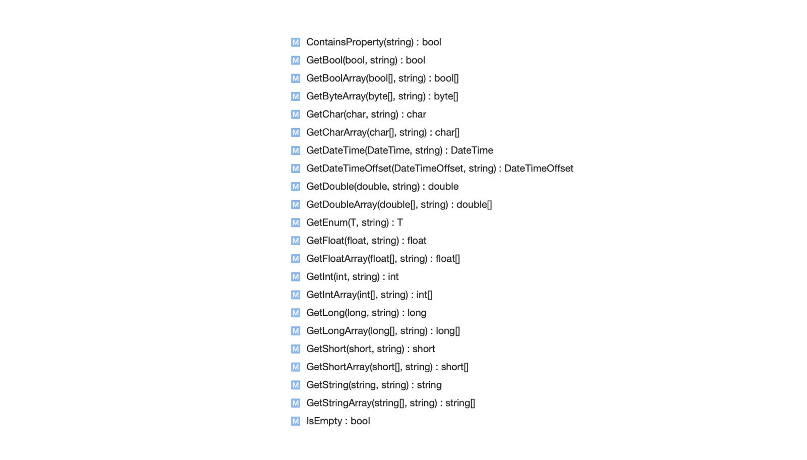

[... Back to CONTENTS](index.md)

---

# Complete sample

Whole sample code is [available in the repository](https://github.com/epam-xamarin-lab/FlexiMvvm/tree/master/samples/003-Intro-Parameters/).

# Navigation with Parameters

Usually while navigating to a screen, we need to pass some parameters visible by a target View Model to run appropriate initialization. iOS and Android have completely different native approaches to do this.
- On iOS we can simply instantiate a new View Controller instance and store needed data in its custom Properties
- On Android things get complicated slightly as navigation from an Activity or settlement a Fragment requires the use of the ``Bundle`` instance.

Let's reuse the previous [Navigation](001-introduction-03-navigation.md) tutorial to pass some parameters onto the User Profile screen.

### Parameters type

We're adding a new custom Parameters type, Sample.Core / Presentation / ViewModels / UserProfileParameters.cs, which will hold needed data we're going to pass:

```cs
using FlexiMvvm.ViewModels;

namespace Sample.Core.Presentation.ViewModels
{
    public class UserProfileParameters : Parameters
    {
        public UserProfileParameters(string email)
        {
            Email = email;
        }

        public string? Email
        {
            get => Bundle.GetString();
            set => Bundle.SetString(value);
        }
    }
}

```

So it has a single ``Email`` property the target View Model will be interested in to retrieve while initializing. FlexiMvvm's ``Parameters`` base class is used to inherit its capabilities to propagate parameters, as we can see in ``Email``'s setter and getter the ``Bundle`` entry property is used for that. It provides the wide range of methods to get or set values. Internally, the data preserved transparently as a dictionary on iOS, or as a native Bundle on Android allowing to safely pass across Activities/Fragments.



### View Model with Parameters

Having ``UserProfileParameters``, we update ``UserProfileViewModel``:
1. Making it generic, with provided base ``LifecycleViewModel<TParameter>``
2. Overriding ``Initialize`` which now has the parameters passed in.

```cs

using FlexiMvvm.Commands;
using FlexiMvvm.ViewModels;

namespace Sample.Core.Presentation.ViewModels
{
    public class UserProfileViewModel : LifecycleViewModel<UserProfileParameters>
    {
        //// ... some existing code is hidden for convenience

        public override void Initialize(UserProfileParameters? parameters, bool recreated)
        {
            base.Initialize(parameters, recreated);

            Email = parameters?.Email ?? string.Empty;

            System.Diagnostics.Debug.WriteLine($"Doing init with the Email parameter passed: '{Email}'...");

            FirstName = "Jeremy";
            LastName = "Simpson";
        }

        //// ... some existing code is hidden for convenience
    }
}

```

### Navigation

Ok, we have Parameters data type and View Model which is capable to use it.
Now we need to adapt the navigation service. Let's add an additional method with the Parameters instance, to enforce passing it to the target View Model:

```cs
using FlexiMvvm.ViewModels;
using Sample.Core.Presentation.ViewModels;

namespace Sample.Core.Presentation.Navigation
{
    public interface INavigationService
    {
        void NavigateToUserProfile(EntryViewModel from);

        void NavigateToUserProfile(ILifecycleViewModel from, UserProfileParameters parameters);
    }
}

```

Just for the demonstration, the previous ``NavigateToUserProfile()``  method is left here as well. New overloaded version does not specify the source View Model type directly but uses ``ILifecycleViewModel`` type instead - this will allow to navigate from any screen, but passing required ``UserProfileParameters`` instance.

#### Android

###### Navigation

There's the full version on the Android version of the ``AppNavigationService``.
Previous ``NavigateToUserProfile()`` is left unchanged. But the new one shows a shorthand to run the navigation - instead of incorporating Intents explicitly, base ``Navigate()`` / ``NavigateBack()`` methods may be used for typical scenarios to navigate forward (starting a new activity or putting in a fragment) or backward.

```cs
using Android.Content;
using FlexiMvvm.Navigation;
using FlexiMvvm.ViewModels;
using FlexiMvvm.Views;
using Sample.Core.Presentation.Navigation;
using Sample.Core.Presentation.ViewModels;
using Sample.Droid.Views;

namespace Sample.Droid.Navigation
{
    public class AppNavigationService : NavigationService, INavigationService
    {
        public void NavigateToUserProfile(EntryViewModel from)
        {
            var splashActivity = NavigationViewProvider.GetActivity<SplashScreenActivity, EntryViewModel>(from);

            var intent = new Intent(splashActivity, typeof(UserProfileActivity));
            intent.AddFlags(ActivityFlags.ClearTask | ActivityFlags.ClearTop | ActivityFlags.NewTask);
            splashActivity.StartActivity(intent);
        }

        public void NavigateToUserProfile(ILifecycleViewModel from, UserProfileParameters parameters)
        {
            var view = NavigationViewProvider.Get(from);
            Navigate<UserProfileActivity, UserProfileParameters>(view, parameters);

            /* Here's what is approximately done by Navigate() above:

            var source = view.GetActivity();
            var intent = new Intent(source, typeof(UserProfileActivity));
            intent.PutParameters(parameters);
            source.StartActivity(intent);

            */
        }
    }
}

```

As shown in the commented section, base ``Navigate()`` will internally initiate a new Android ``Intent`` and propagate ``UserProfileParameters`` "bundled" via it.

###### Activity

With the new View Model (enriched with the Parameters generic type parameter), associated Activity/Fragment will also require a slight update: the ``UserProfileParameters`` type parameter should be specified as well:

```cs
using Android.App;
using Android.OS;
using Android.Views;
using Android.Widget;
using FlexiMvvm;
using FlexiMvvm.Bindings;
using FlexiMvvm.Views;
using Sample.Core.Presentation.ViewModels;

namespace Sample.Droid.Views
{
    [Activity(Theme = "@style/AppTheme.NoActionBar")]
    public class UserProfileActivity : BindableAppCompatActivity<UserProfileViewModel, UserProfileParameters>
    {
        //// ... some existing code is hidden for convenience
    }
}

```

#### iOS

###### Navigation

iOS implementation for the new parameter is very similar to the Android one, having the base ``Navigate()`` method used.

```cs
using System;
using FlexiMvvm.Navigation;
using FlexiMvvm.ViewModels;
using Sample.Core.Presentation.Navigation;
using Sample.Core.Presentation.ViewModels;
using Sample.iOS.Views;

namespace Sample.iOS.Navigation
{
    public class AppNavigationService : NavigationService, INavigationService
    {
        public void NavigateToUserProfile(EntryViewModel from)
        {
            var controller = NavigationViewProvider.GetViewController<RootNavigationViewController, EntryViewModel>(from);
            controller.PushViewController(new UserProfileViewController(), false);
        }

        public void NavigateToUserProfile(ILifecycleViewModel from, UserProfileParameters parameters)
        {
            var view = NavigationViewProvider.Get(from);
            var target = new UserProfileViewController();
            Navigate(view, target, parameters, false);

            /* Here's what is done by Navigate() above:

            target.SetParameters(parameters);
            view.GetNavigationController().PushViewController(target, false);

            */
        }
    }
}

```

Again, the commented section shows what's happening inside - FlexiMvvm tries to leverage an available NavigationController to push the new one, with the Parameters specified via the ``SetParameters()`` method.

###### View Controller 

So the only change is to specify the ``UserProfileParameters`` type parameter:

```cs
using FlexiMvvm.Bindings;
using FlexiMvvm.Views;
using Sample.Core.Presentation.ViewModels;

namespace Sample.iOS.Views
{
    public class UserProfileViewController : BindableViewController<UserProfileViewModel, UserProfileParameters>
    {
        //// ... some existing code is hidden for convenience
    }
}

```

### Last step

Finally, to start the navigation, let's fake this action from our ``EntryViewModel``:

```cs
using FlexiMvvm.ViewModels;
using Sample.Core.Presentation.Navigation;

namespace Sample.Core.Presentation.ViewModels
{
    public class EntryViewModel : LifecycleViewModel
    {
        //// ... some existing code is hidden for convenience

        public override void Initialize(bool recreated)
        {
            base.Initialize(recreated);

            _navigationService.NavigateToUserProfile(this, new UserProfileParameters("example@icloud.com"));
        }
    }
}

```

---

[Next: Navigation for a Result](001-introduction-05-result.md)