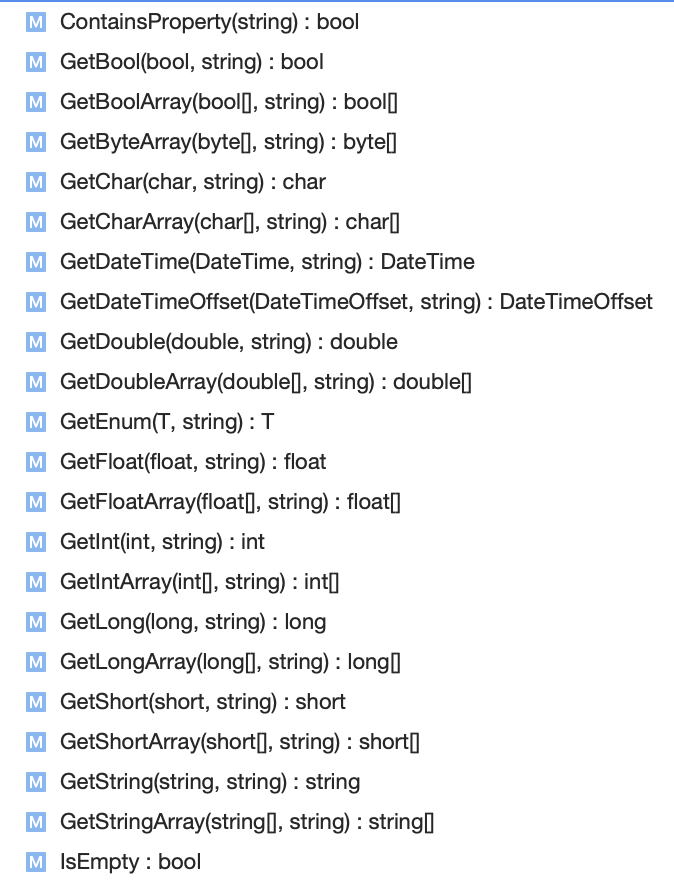

[... Back to CONTENTS](index.md)

---

# Screen with Parameters

Usually while navigating to a screen, we need to pass some parameters visible by View Model to run appropriate initialization. iOS and Android have completely different native approaches how to do this.
- On iOS we can simply instanciate new View Controller instance and store needed data in Properties
- On Android things get complicated slightly as navigation from an Activity or settlement a Fragment, requires the use of the ``Bundle`` instance.

Let's reuse the previous [Navigation](001-introduction-03-navigation.md) tutorial to pass some parameters onto the User Profile screen.

### Parameters type

We add a new custom Parameters type, FirstScreen.Core / Presentation / ViewModels / UserProfileParameters.cs:

```cs
namespace FirstScreen.Core.Presentation.ViewModels
{
    public class UserProfileParameters : FlexiMvvm.ViewModels.Parameters
    {
        public UserProfileParameters(string email)
        {
            Email = email;
        }

        public string Email
        {
            get => Bundle.GetString();
            set => Bundle.SetString(value);
        }
    }
}
```

So it has a single ``Email`` property the target View Model will be interested in to retrieve while initializing. Base class is used to inherit the parameters propagation via native APIs - and we can see in ``Email``'s setter and getter the ``Bundle`` entry property from the base class is used. It provides the wide range of methods to get or set primitive types. Internally, the data preserved as a dictionaly on iOS, or as a native Bundle on Android.



### View Model with Parameters

Having ``UserProfileParameters``, we update ``UserProfileViewModel``:
1. Making it generic
2. Using base ``Parameters`` property which is strongly typed now and provides the ``Email`` passed in.

```cs

using System.Threading.Tasks;
using System.Windows.Input;
using FirstScreen.Core.Infrastructure.Data;
using FlexiMvvm.ViewModels;

namespace FirstScreen.Core.Presentation.ViewModels
{
    public class UserProfileViewModel : ViewModel<UserProfileParameters>
    {

        //// ... some existing code is hidden for convenience

        public override async Task InitializeAsync()
        {
            await base.InitializeAsync();

            System.Diagnostics.Debug.WriteLine(
                $"Using Parameters... Email = {Parameters.Email}");
        }        

        //// ... some existing code is hidden for convenience

    }
}
```

### Navigation

Ok, we have Parameters data type and View Model which is capable to use it. Now we need to adapt the navigation service. Add an additional parameter to the method, to enforce passing the ``UserProfileParameters`` instance:

```cs
using FirstScreen.Core.Presentation.ViewModels;

namespace FirstScreen.Core.Presentation.Navigation
{
    public interface INavigationService
    {
        void NavigateToUserProfile(EntryViewModel from, UserProfileParameters parameters);
    }
}
```

#### Android

TBD

#### iOS

iOS implementation for the new parameter, FirstScreen.iOS / Navigation / NavigationService.cs:

```cs
using System;
using FirstScreen.Core.Presentation.Navigation;
using FirstScreen.Core.Presentation.ViewModels;
using FirstScreen.iOS.Views;

namespace FirstScreen.iOS.Navigation
{
    public class NavigationService : FlexiMvvm.Navigation.NavigationService, INavigationService
    {
        public void NavigateToUserProfile(EntryViewModel from, UserProfileParameters parameters)
        {
            var controller =
                GetViewController<RootNavigationViewController, EntryViewModel>(from);
                
            controller.PushViewController(new UserProfileViewController(parameters), false);
        }
    }
}
```

So the only change is to pass parameters to the target View Controller constructor. To be able to do it, we're updating FirstScreen.iOS / Views / UserProfileViewController.cs:

```cs
using System;
using FirstScreen.Core.Presentation.ViewModels;
using FlexiMvvm.Bindings;
using FlexiMvvm.Views;

namespace FirstScreen.iOS.Views
{
    public class UserProfileViewController : BindableViewController<UserProfileViewModel, UserProfileParameters>
    {
        public UserProfileViewController(UserProfileParameters parameters) : base(parameters)
        {
            Title = "Profile";
        }

        //// ... some existing code is hidden for convenience
    }
}

```

We see here that the second type parameter is used over the generic base class and constructor is added to make the Parameters instance required for ``UserProfileViewController``.


### Last step

Finally, we're tuning our navigation to the User Profile, FirstScreen.Core / Presentation / ViewModels / EntryViewModel.cs:

```cs
using System.Threading.Tasks;
using FirstScreen.Core.Presentation.Navigation;
using FlexiMvvm.ViewModels;

namespace FirstScreen.Core.Presentation.ViewModels
{
    public class EntryViewModel : ViewModel
    {
        //// ... some existing code is hidden for convenience

        public override async Task InitializeAsync()
        {
            await base.InitializeAsync();

            _navigationService.NavigateToUserProfile(this, new UserProfileParameters("example@icloud.com"));
        }
    }
}
```
---

[Next: ...](index.md)