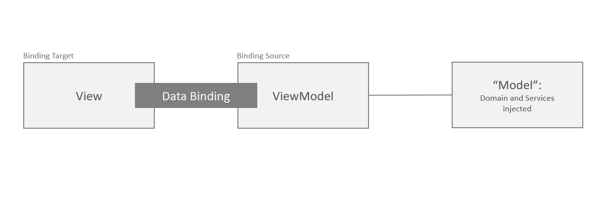

[... Back to CONTENTS](index.md)

---

# Data Bindings

To recap, let's review the **Model-View-ViewModel** (MVVM) pattern. Why it became so important for Xamarin mobile apps?

Historically, this approach allowed to gracefully separate concerns for GUI application: presentation, view state management and domain data. Encouraged by Microsoft, its adoption became popular with XAML on WPF, Silverlight, Windows Phone, and now - on UWP and Xamarin.Forms stacks. Dedicated MVVM frameworks like MVVM Light Toolkit or Caliburn.Micro has been playing the crucial role.



**Data Bindings** are used to evade from writing boiler-plate code to synchronize Views and ViewModels. Assuming we're familiar with this technic, let's review how FlexiMvvm deals with Data Binding.

With FlexiMvvm, we can use either out-of-the-box Data Bindings provided for common iOS and Android controls like Labels, Text Entries, Buttons or **custom Data Binding** for our UI components with own events and custom data representation.

Lets review how concise and unified iOS and Android specific Data Bindings look like. Complete [sample is available in the repository](https://github.com/epam-xamarin-lab/FlexiMvvm/tree/master/samples/005-Intro-DataBindings/).

#### iOS

Normally, on iOS View is managed by View Controller. For our sample, ``UserProfileViewController`` links target screen controls including Buttons with ``UserProfileViewModel`` ViewModel's Data Properties and Commands. This allows to concentrate on visual implementation of the View, and leave reusable behavior control to ViewModel.

```cs
//// ... some existing code is hidden for convenience

namespace Sample.iOS.Views
{
    public class UserProfileViewController : BindableViewController<UserProfileViewModel, UserProfileParameters>
    {
        //// ... some existing code is hidden for convenience

        public override void Bind(BindingSet<UserProfileViewModel> bindingSet)
        {
            base.Bind(bindingSet);

            //// Two-way default bindings

            bindingSet.Bind(View.FirstName)
                .For(v => v.TextAndEditingDidEndBinding())
                .To(vm => vm.FirstName);

            bindingSet.Bind(View.LastName)
                .For(v => v.TextAndEditingDidEndBinding())
                .To(vm => vm.LastName);

            bindingSet.Bind(View.Email)
                .For(v => v.TextAndEditingDidEndBinding())
                .To(vm => vm.Email);

            //// One-way-to-source default binding

            bindingSet.Bind(View.SelectLanguageButton)
                .For(v => v.TouchUpInsideBinding())
                .To(vm => vm.NavigateToLanguagesCommand);

            bindingSet.Bind(View.SaveButton)
                .For(v => v.TouchUpInsideBinding())
                .To(vm => vm.SaveCommand);

            //// One-way default binding

            bindingSet.Bind(View.LanguageSelected)
                .For(v => v.TextBinding())
                .To(vm => vm.Language);

            bindingSet.Bind(View.DateOfBirthSelected)
                .For(v => v.TextBinding())
                .To(vm => vm.DateOfBirthday);

            //// Custom Two-way Data Binding with Value Converter

            bindingSet.Bind(View)
                .For(v => v.DateOfBirthdayChangedBinding())
                .To(vm => vm.DateOfBirthday)
                .WithConversion<StringToDateTimeValueConverter>();
        }
    }
}

```

#### Android

On Android, Activity (or Fragment) plays the primary role of inflating UI and controlling its state. Same way, it defines all needed Data Bindings wiring specific View properties and events up to the ViewModel via Data Bindings.

```cs
//// ... some existing code is hidden for convenience

namespace Sample.Droid.Views
{
    [Activity(Theme = "@style/AppTheme.NoActionBar")]
    public class UserProfileActivity : BindableAppCompatActivity<UserProfileViewModel, UserProfileParameters>
    {
        //// ... some existing code is hidden for convenience

        public override void Bind(BindingSet<UserProfileViewModel> bindingSet)
        {
            base.Bind(bindingSet);

            //// Two-way default bindings

            bindingSet.Bind(_firstName)
                .For(v => v.TextAndTextChangedBinding())
                .To(vm => vm.FirstName);

            bindingSet.Bind(_lastName)
                .For(v => v.TextAndTextChangedBinding())
                .To(vm => vm.LastName);

            bindingSet.Bind(_email)
                .For(v => v.TextAndTextChangedBinding())
                .To(vm => vm.Email);

            //// One-way-to-source default binding

            bindingSet.Bind(_selectLanguage)
                .For(v => v.ClickBinding())
                .To(vm => vm.NavigateToLanguagesCommand);

            bindingSet.Bind(_save)
                .For(v => v.ClickBinding())
                .To(vm => vm.SaveCommand);

            //// One-way default binding

            bindingSet.Bind(_language)
                .For(v => v.TextBinding())
                .To(vm => vm.Language);

            bindingSet.Bind(_dateOfBirth)
                .For(v => v.TextBinding())
                .To(vm => vm.DateOfBirthday);

            //// Custom Two-way Data Binding with Value Converter

            bindingSet.Bind(this)
                .For(v => v.DateOfBirthdayChangedBinding())
                .To(vm => vm.DateOfBirthday)
                .WithConversion<StringToDateTimeValueConverter>();
        }

        //// ... some existing code is hidden for convenience
    }
}

```

#### Basic approach

This simple case demonstrates how well unified may be coding UI behavior for these so different platforms. To accomplish this, the following approach is used:

1. ``BindingSet`` works as an entry to build Data Binding in a fluent style.
2. ``.Bind()`` specifies target object. It may be UILabel, DateTimePicker, whole Activity or any arbitrary object you want to track state of.
3. ``.For()`` defines Binding itself. For simplicity, extension methods are used for that. Example: ``ClickBinding()`` extension method which is capable to wire up a ``Click`` event.
4. ``.To()`` links with a source. Typically, it's ViewModel's Data Property or Command.
5. Optional ``WithConversion()`` allows to engage a Value Converter between Source and Target bound.
6. Optional ``WithFallbackValue()`` to provide a "default" if Source is null or faulty.

#### Diving into details

Before learning how to create our own Data Bindings, let's have a look how standard are built.

Actually everything is based just on 3 base classes:
1. *TargetItemOneWayCustomBinding* - for **One Way**: from ViewModel to View. Example: propagating text to a UI Label.
2. *TargetItemOneWayToSourceCustomBinding* - for **One Way to Source**: to ViewModel from View; like propagating a selected item chosen from a list.
3. *TargetItemTwoWayCustomBinding* - for **Two Way**: both directions like a Text entry's value.

This is one of the FlexiMvvm's standard One-way Data Bindings for iOS UILabel's Text value wiring which has been used above for binding ViewModel's DateOfBirthday Data Property.

```cs
//// ... some existing code is hidden for convenience

namespace FlexiMvvm.Bindings
{
    public static class UILabelBindings
    {
        //// ... some existing code is hidden for convenience

        public static TargetItemBinding<UILabel, string> TextBinding(this IItemReference<UILabel> labelReference)
        {
            if (labelReference == null)
                throw new ArgumentNullException(nameof(labelReference));

            return new TargetItemOneWayCustomBinding<UILabel, string>(
                labelReference,
                (label, text) => label.NotNull().Text = text,
                () => "Text");
        }
    }
}
```

As we can see, **TargetItemOneWayCustomBinding** play the role of a data transfer object, providing all the necessary information for FlexiMvvm: the View object type (UILabel), Target Property data type (string), the View instance to apply data on (labelReference), the expression which performs the actual data applying (``label.Text = text``), and even the functor which logs the diagnostics trace (``"Text"``).

> This first example's resume is that FlexiMvvm tries to avoid Reflection completely, when possible. For efficiency, tt's better to provide a string for logging rather than inferring with Reflection at runtime.

---

[Next: Data Bindings - Custom](001-introduction-07-data-bindings-custom.md)
